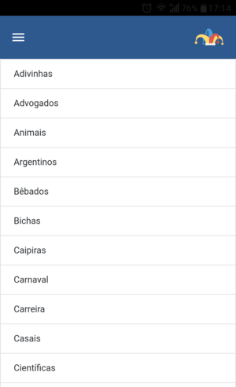

# SoPiadas

    Aplicativo projetado para exercitar as práticas de dilvugação de apps através das plataformas de 
    marketing digital, tais como Facebook ads e Google ads.

    Em breve você poderá baixar o aplicativo diretamente do Play Store, só estamos aguardando a liberação da Google para que o nosso app começe a circular 

# Características

    Pode-se dizer que toda as principais funcionalidades do aplicativo já estão funcionando perfeitamente; como a função de compartilhamento e favoritar a piadas.

 

    No entanto, tem-se pensando em adicionar funcionalidades mais adiante, tais como criar um ambiente onde as pessoas posssam interagir com as piadas, seja através de comentários ou curtidas. E quem sabe, elas possam postar suas próprias piadas

 

# Objetivo 

 
    Só piadas é um aplicativo criado durante a pandemia do covid-19 com o intuito de fazer com que as pessoas que se encontram debaixo do mesmo teto se reunam e socializem umas com as outras, ao invês de cada uma ir para um cômodo da casa, ignorando a presença do próximo.
    O aplicativo contém piadas para todos os gostos, além das opções de compartilha-las para fazer outras pessoas darem belas gargalhadas e a opção de favoritar.

    Por fim, vale ressaltar que está é uma versão de mpv (mínimo produto viável), ou seja, muitas coisas ainda serão implementadas e adicionadas. 
    Outro ponto importante a se destacar é que foi criado um robô para extrair algumas piadas do site 
    http://www.piadasaqui.com.br/

